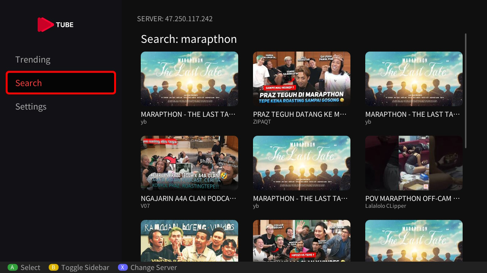
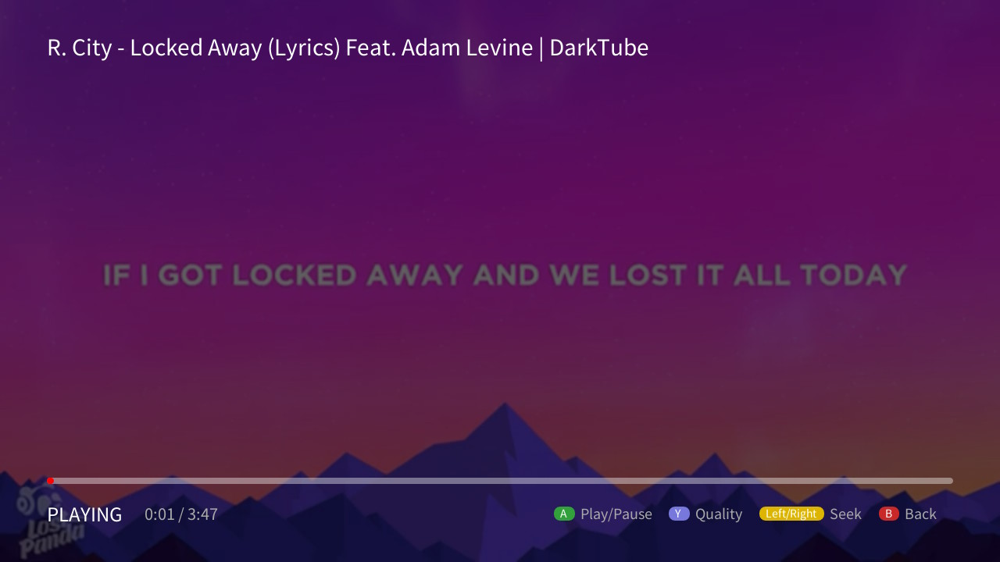

# DarkTube

[English Version Below](#english-version)

DarkTube adalah sebuah aplikasi _frontend homebrew_ alternatif YouTube untuk Nintendo Switch dengan Custom Firmware (CFW). Karena Switch CFW secara bawaan tidak dapat menggunakan aplikasi YouTube resmi (atau diblokir oleh server Nintendo), DarkTube hadir sebagai solusi agar Anda tetap dapat menikmati YouTube langsung dari konsol Switch.

Aplikasi ini menggunakan API resmi YouTube v3 untuk mengambil daftar video, hasil pencarian, dan informasi _channel_. Sementara itu, untuk proses _streaming_ video, aplikasi ini menggunakan _core_ dari [yt-dlp](https://github.com/yt-dlp/yt-dlp).

## 🖼️ Showcase





---

## 🇮🇩 Fitur Utama

- Jelajahi video dan channel YouTube dengan mudah.
- Tonton video langsung di Nintendo Switch.
- Antarmuka (_User Interface_) yang khusus disesuaikan untuk layar Switch dan nyaman dikendalikan dengan D-Pad (karena dibangun menggunakan _library_ `borealis`).

## Catatan Penting & Disclaimer

**Aplikasi ini dibuat murni untuk TUJUAN EDUKASI (Educational Purposes Only).**

- Saya **TIDAK** menyediakan tautan bajakan, konten ilegal, atau melakukan pencurian data/konten dalam bentuk apa pun.
- Segala bentuk penggunaan dari aplikasi ini sepenuhnya menjadi risiko dan tanggung jawab pengguna.

## Instruksi Instalasi di Nintendo Switch

Pemasangannya di Switch sangat sederhana, sama seperti aplikasi _homebrew_ pada umumnya:

1. Unduh file `.nro` DarkTube versi terbaru dari halaman _Releases_ di GitHub (jika sudah tersedia), atau Anda juga bisa melakukan _build_ sendiri.
2. Salin file `DarkTube.nro` tersebut ke dalam folder `switch/` yang ada di SD Card Anda (jalurnya: `sdmc:/switch/DarkTube.nro`).
3. Buka _Homebrew Menu_ (hbmenu) dari Switch Anda, lalu pilih dan jalankan DarkTube.

## Instruksi Instalasi Self-Server Backend

Untuk saat ini, penggunaan DarkTube mewajibkan Anda untuk memiliki (melakukan _host_) _server backend_ sendiri. _Backend_ ini bertugas menangani _request_ API ke YouTube agar prosesnya lebih aman dan terkontrol.

- Repositori Server: [Ibnuard/darktube-server](https://github.com/Ibnuard/darktube-server)
- Silakan ikuti petunjuk instalasi dan pengaturan server (termasuk _Environment Variables_, API Keys, dll.) yang terdapat pada README di repositori server tersebut.

## Cara Build Sendiri (Kompilasi dari Source)

Jika Anda ingin melakukan kompilasi mandiri dari _source code_, Anda memerlukan perangkat pengembangan _homebrew_ Switch, seperti _devkitPro_.

### Persyaratan / Requirements:

- [devkitPro](https://devkitpro.org/) dengan _toolchain_ untuk Switch (`devkitA64`, `libnx`).
- `dkp-pacman` (_package manager_ bawaan dari devkitPro).
- _Library_ dasar: `switch-glfw`.

### Langkah-langkah Build:

1. **Clone repositori ini:**

   ```bash
   git clone --recursive https://github.com/Ibnuard/darktube-core.git
   cd darktube-core
   ```

2. **Instal dependensi bawaan dan paket kustom:**
   Jalankan skrip instalasi paket (skrip ini akan secara otomatis mengunduh dan menginstal _library_ seperti `deko3d`, `switch-ffmpeg`, `switch-libmpv`, dll. menggunakan `dkp-pacman`):

   ```bash
   ./install_custom_pkgs.sh
   ```

3. **Mulai Kompilasi:**
   Gunakan skrip _build_ untuk menjalankan `cmake` dan `make`:

   ```bash
   ./build_nro.sh
   ```

   Setelah proses kompilasi selesai, file `DarkTube.nro` akan tersedia di dalam direktori `build/`.

---

<a id="english-version"></a>

# DarkTube (English Version)

DarkTube is a homebrew frontend acting as a YouTube alternative for custom firmware (CFW) Nintendo Switch consoles. Since CFW Switches lack access to the official YouTube app, DarkTube provides a solution to watch YouTube videos directly on your modern modified console.

The application utilizes the official YouTube v3 API to fetch video lists, searches, and channel information. For video streaming, the core relies on `yt-dlp`.

## 🖼️ Showcase


---

## 🇬🇧 Main Features

- Browse YouTube videos and channels.
- Watch videos natively on your Nintendo Switch.
- Controller-friendly UI (powered by the `borealis` library).

## Important Notes & Disclaimer

**This application is created STRICTLY for EDUCATIONAL PURPOSES.**

- I **DO NOT** provide or host any pirated links, illegal content, or engage in any form of data/content theft.
- The use of this application is purely at the user's own risk.

## Installation Instructions (Nintendo Switch)

Installation on the Switch is straightforward, mirroring standard homebrew application installation:

1. Download the latest `.nro` file from the _Releases_ page (if available) or build it yourself.
2. Copy the `DarkTube.nro` file into the `switch/` folder on your SD Card (path: `sdmc:/switch/DarkTube.nro`).
3. Launch the _Homebrew Menu_ (hbmenu) on your Switch and run DarkTube.

## Self-Hosted Server Backend Instructions

Currently, using DarkTube requires you to host your own backend server. This backend is responsible for securely handling API requests to YouTube.

- Server Repository: [Ibnuard/darktube-server](https://github.com/Ibnuard/darktube-server)
- Please follow the installation and server setup instructions (Environment Variables, API Keys, etc.) found in the README of the server repository.

## How to Build from Source

If you wish to compile the application yourself, you will need the Switch homebrew development toolkit (devkitPro).

### Requirements:

- [devkitPro](https://devkitpro.org/) with the Switch toolchain (`devkitA64`, `libnx`).
- `dkp-pacman` (devkitPro package manager).
- Basic Switch libraries: `switch-glfw`.

### Build Steps:

1. **Clone this repository:**

   ```bash
   git clone --recursive https://github.com/Ibnuard/darktube-core.git
   cd darktube-core
   ```

2. **Install custom packages and dependencies:**
   Run the package installation script (this will download and install required libraries like `deko3d`, `switch-ffmpeg`, `switch-libmpv`, etc. via `dkp-pacman`):

   ```bash
   ./install_custom_pkgs.sh
   ```

3. **Compile the app:**
   Use the provided build script to run `cmake` and `make`:
   ```bash
   ./build_nro.sh
   ```
   Once the build completes successfully, the `DarkTube.nro` executable will be generated inside the `build/` directory.

---

## 🤍 Credits & Acknowledgements

- Huge thanks to [xfangfang/wiliwili](https://github.com/xfangfang/wiliwili) for providing the compiled custom packages and libraries required to build this project.
